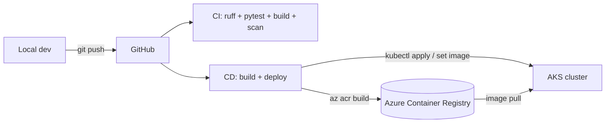
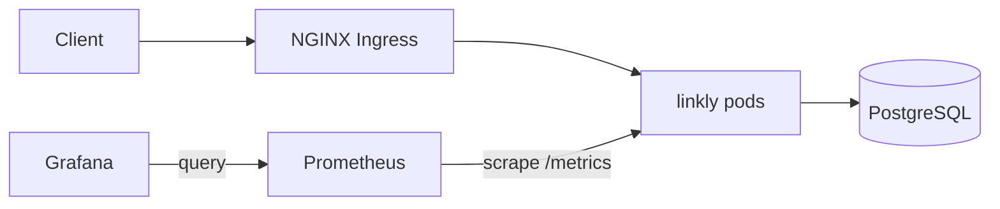

# Architecture

## Delivery pipeline

## Runtime

## Where each skill lives

| Area | What it does | Files |
| --- | --- | --- |
| App | FastAPI URL shortener with Prometheus metrics | `app/` |
| Containers | Multi-stage, non-root image | `Dockerfile` |
| Local stack | App + Postgres + Prometheus + Grafana | `docker-compose.yml`, `monitoring/` |
| Kubernetes | Deployment, Service, HPA, Ingress, Postgres StatefulSet | `k8s/` |
| Monitoring | ServiceMonitor + Grafana dashboard | `k8s/monitoring/`, `monitoring/grafana/` |
| Infrastructure | Resource group, ACR, AKS, remote state | `terraform/` |
| CI | Lint, test, build, image scan | `.github/workflows/ci.yml` |
| CD | OIDC auth, push to ACR, deploy to AKS | `.github/workflows/cd.yml` |
